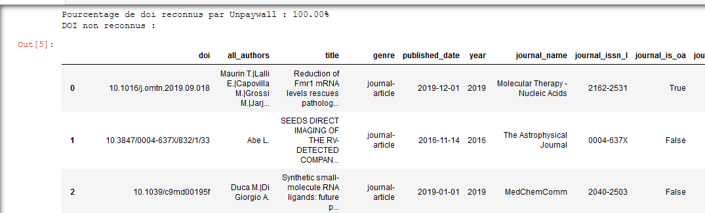
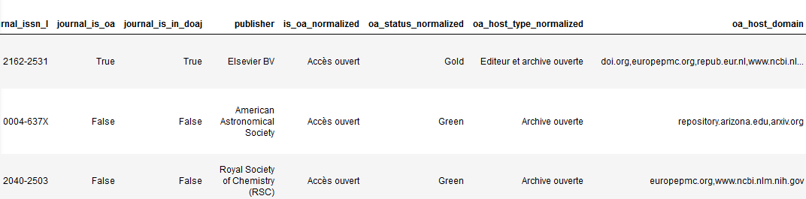
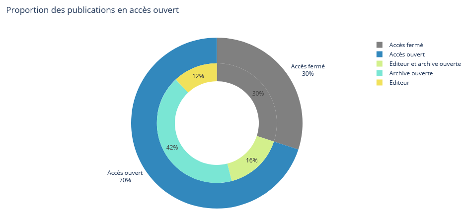
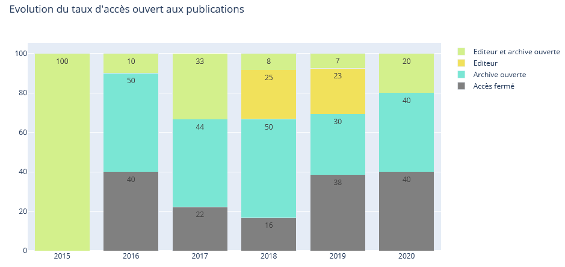
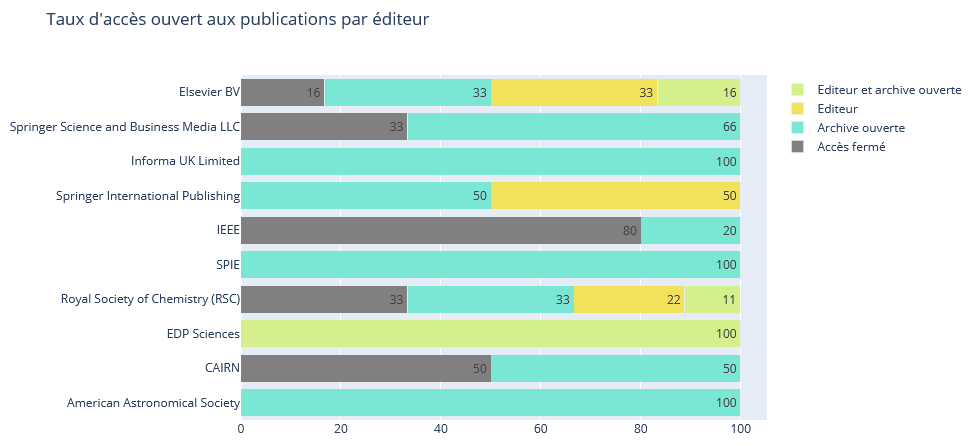
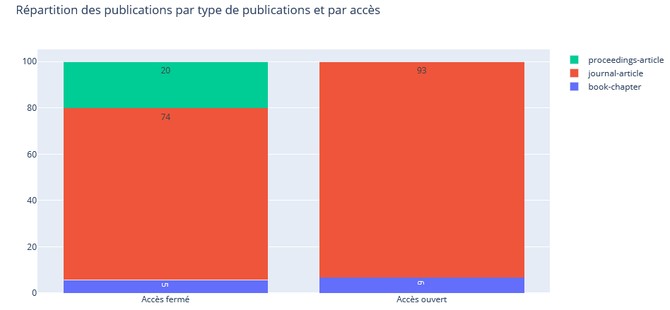
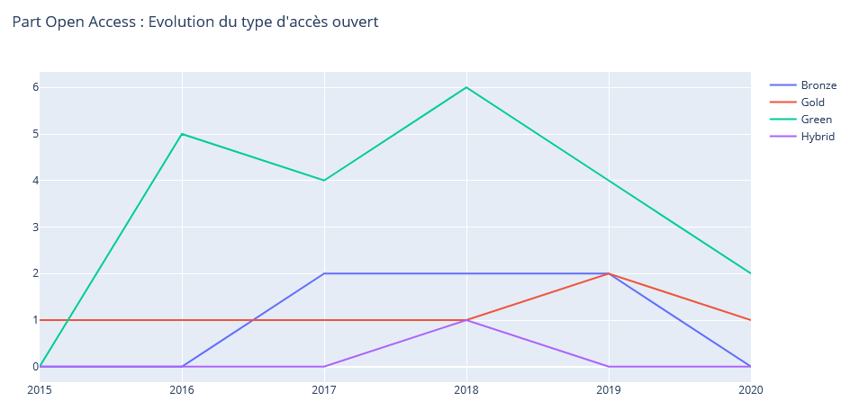
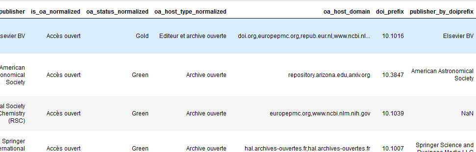
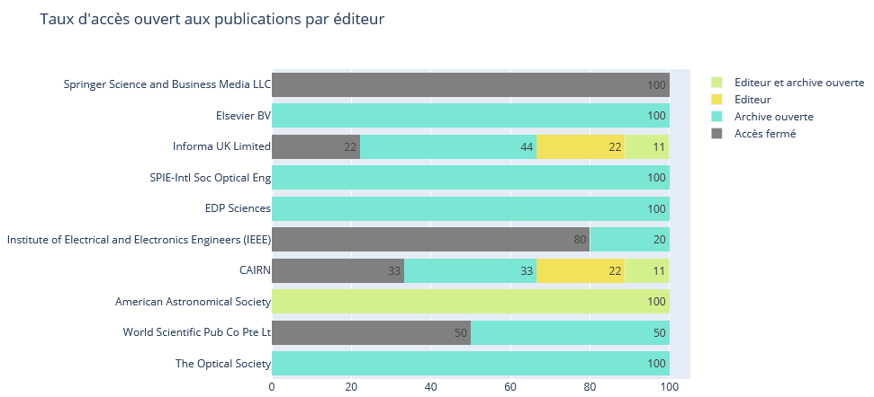

pybso - Générateur de baromètre Open Access local
========================================================

Ce package automatise la récupération des données et la production des graphiques pour la constitution d'un baromètre local de l'Open Access sur le modèle du [baromètre national de la science ouverte](https://ministeresuprecherche.github.io/bso/) développé par le M.E.S.R.I.

## Installation
Vous pouvez l'installer avec [pip](https://pypi.org/project/pybso/) :

    pip install pybso
    
## Import

    import pybso.core as core
    import pybso.charts as charts

## Remarques

Le package ne traite pas la question des affiliations des publications et ne prend pas en charge la constitution du set de publications de départ, vous devez vous constituer en amont votre corpus de DOI à analyser.

Ce package est optimisé pour une utilisation dans le cadre d'un Jupyter Notebook.

Un notebook de démo se trouve dans le dossier /demo/

Pour l'ouvrir en version exécutable : 

## Fonctionnement

Le package propose deux modules pensés pour être exécutés l'un à la suite de l'autre :
- pybso.core : fonctions de requêtage de l'API d'Unpaywall à partir d'un set de DOI et de récupération des métadonnées OA nécessaires pour la constitution du baromètre. Un autre ensemble de fonctions permettent également d'interroger l'API prefixes de Crossref sur la base des préfixes de DOI afin d'obtenir les labels des éditeurs de manière plus homogénéisée qu'avec Unpaywall.
- pybso.charts : fonctions d'affichage des graphiques constituant le baromètre à partir des données moissonnées et mises en forme avec le module précédent.

Chacune des fonctions de moissonnage de données et de production de graphiques peut prendre en entrée soit un dataframe soit un fichier plat stocké sur votre PC. Les fichiers en input peuvent être aux formats csv, Json ou Excel (.xls ou .xlsx).
Les fonctions du module pybso.core retournent des dataframes, mais permettent aussi de produire et de sauvegarder des fichiers de résultats également au format csv, Json ou Excel.

Ce mode de fonctionnement a été pensé pour :
- archiver les données moissonnées et donner la possibilité de les analyser autrement ou les intégrer dans des applications tierces ;
- ne pas figer le tableau de bord sur une source unique et pouvoir moduler les graphiques à partir de fichiers différents ;
- potentiellement pouvoir historiciser les données et afficher sur un même notebook des états différents d'OA pour le même corpus.

### Fonctions de requêtages d'API pour l'enrichissement du jeu de DOI

#### Interrogation de l'API d'Unpaywall

*Documentation sur le format de données Unpaywall : https://unpaywall.org/data-format*

1. Métadonnées bibliographiques moissonnés sans modification : deviennent des champs supplémentaires "title","genre" (type de document),"published_date","year","publisher","journal_name","journal_issn_l","journal_is_oa","journal_is_in_doaj"
   
2. Champs relatifs à l'analyse OA avec post-traitement

   - "is_oa" : valeurs True/False -> deviennent Accès ouvert/Accès fermé dans un nouveau champ "is_oa_normalized"
   - "oa_status" : green, gold, hybrid etc... -> deviennent Green, Gold, Hybrid etc... dans un nouveau champ "oa_status_normalized"
   - champs host_type de l'object oa_locations (fournit tous les types d'hébergement des différentes versions de la publication) : les valeurs possibles publisher/repository sont concaténées et converties en libellé unifié dans un nouveau champ "oa_host_type_normalized" : 
     - "Archive ouverte" si pas de mention publisher, 
     - "Editeur" si pas de mention repository, 
     - "Editeur et archive ouverte" si les 2 mentions sont présentes, 
     - "Accès fermé" si le champ "is_oa" est False.
    - champs url de l'object oa_locations (fournit pour chaque dépôt l'url d'accès au document) : les noms de domaine sont extraits des urls et concaténés dans un nouveau champ unique "oa_host_domain" (ex : "archimer.ifremer.fr,ejournals.epublishing.ekt.gr,hal-univ-perp.archives-ouvertes.fr,hal-univ-perp.archives-ouvertes.fr")

#### Interrogation de l'API Metadata de Crossref

*Documentation : https://github.com/CrossRef/rest-api-doc*

Elle permet d'homogénéiser le nom de l'éditeur fourni par Unpaywall en récupérant le libellé de l'éditeur propriétaire (le "prefix owner") lors de l'attribution du DOI, identifiable par le préfixe de chaque DOI.

La liste des prefix owner membres de Crossref est disponible ici https://www.crossref.org/06members/50go-live.html 

L'API utilisé est https://api.crossref.org/prefixes/{doi}

Deux nouveaux champs sont ajoutés aux données de départ : "doi_prefix" et "publisher_by_doiprefix"

### Fonctions de mise en forme graphique des indicateurs d'ouverture des publications 

La librairie graphique utilisée est Plotly, notamment pour ses fonctionnalités interactives de rendu (légende cliquable, export, annotations, sélection, zoom...).
Les anayses graphiques reprises du baromètre national sont celles relatives : 

- au taux global d'accès ouvert,
- à l'évolution annuelle de ce taux
- au taux d'accès ouvert par éditeur
- au taux d'accès ouvert par type de publication

L'analyse du taux d'accès ouvert par disciplines n'est pas pris en charge dans la mesure où cette donnée n'est pas présente dans les métadonnées Unpaywall (on peut retrouver une indexation sujet par DOI via [cette API Crossref](https://api.crossref.org/works/10.1155/2014/413629) mais inexploitable car très lacunaire). 

L'analyse par disciplines nécessiterait, par exemple, la constitution d'un modèle de Machine Learning de classification supervisée qui s'appuierait sur la classification par apprentissage déjà effectuée pour l'année 2018 dans le cadre du baromètre national comme set d'entrainement, ce qui dépasse le cadre du package.

## Usage

**Les fonctions utilisent des arguments accessibles par mots-clés**

Par exemple 

     function(arg1=arg1,arg2=arg2...)

**Si vous utilez des fichiers csv en entrée, le séparateur est détecté automatiquement à l'import, vous pouvez donc par exemple utiliser comme séparateur la virgule, le point-virgule ou la tabulation**

### Moissonnage des données

#### Données Unpaywall

    core.unpaywall_data(dataframe=dataframe/inpath=inpath,outpath=outpath)

L'appel à la fonction unpaywall_data doit au minimum contenir un paramètre en input :
- dataframe : un dataframe contenant au minimum une colonne de DOI nommée "doi", si d'autres colonnes sont présentes elles seront conservées ; 
- **ou** inpath : le chemin (relatif ou absolu) vers un fichier source au format csv, Json ou Excel  qui doit contenir au minimum une colonne de DOI nommée "doi". Si d'autres colonnes sont présentes elles seront conservées.

Le paramètre outpath est optionnel et, s'il est utilisé, doit contenir le chemin (relatif ou absolu) vers le fichier pour la sauvegarde des résultats. L'archivage des résultats peut être opéré au format csv, Json ou Excel.

Renvoie un dataframe contenant des champs supplémentaires : voir 

Exemples

    core.unpaywall_data(inpath="doi.csv",outpath="upw_output.csv")

ou

    import pandas as pd
    df = pd.read_csv("C:/Users/xxxx/mon_barometre/doi.csv")
    df_result = core.unpaywall_data(dataframe=df)
    
ou
    
    source_path = "doi.json"
    result_path = "upw_output.xlsx"
    
    core.unpaywall_data(inpath=source_path,outpath=result_path)

**Remarques**

Bien que l'API Unpaywall réponde plutôt bien et que les requêtes soient parallélisées (multithread), le temps d'exécution peut être plus ou moins long selon le nombre de DOI à traiter.

La fonction renvoie un dataframe qu'il est possible d'assigner à une variable pour d'autres traitements éventuels.

    df = core.unpaywall_data(**kwargs)

Attention : le nombre d'enregistrements des résultats peut être inférieur au total initial car seuls les DOI reconnus sont conservés.

Sont également fournis dans la réponse le pourcentage de DOI connus d'Unpaywall (code réponse http 200) dans le set de départ ainsi que la liste des DOI non traités car non reconnus. 

#### Données Crossref (mention éditeur à partir du préfixe de DOI)

    core.crossref_publisher_data(dataframe=dataframe/inpath=inpath,outpath=outpath,email=email)

Les 2 arguments à fournir au minimum sont des données en input et une adresse mail requise dans les bonnes pratiques de l'utilisation de l'APi Crossref :
- dataframe : un dataframe contenant au minimum une colonne de DOI nommée "doi", si d'autres colonnes sont présentes elles seront conservées ;
- **ou** inpath : le chemin (relatif ou absolu) vers un fichier source au format csv, Json ou Excel  qui doit contenir au minimum une colonne de DOI nommée "doi". Si d'autres colonnes sont présentes elles seront conservées.
L'idée du package étant de faciliter et fluidifer l'obtention des données nécessaires, le fichier en entrée est idéalement le fichier résultat de l'étape précédente ;
- **et** email : une adresse mail valide. Pas d'authentification requise pour l'utilisation de l'API Crossref gratuite mais son usage est surveillé, et un requêtage abusif (selon Crossref) peut conduire à un blocage d'IP. Une bonne pratique recommandée consiste à ajouter une adresse mail en paramètre et à espacer les requêtes (1 seconde ici).

Le paramètre outpath est optionnel et, s'il est utilisé, doit contenir le chemin (relatif ou absolu) vers le fichier pour la sauvegarde des résultats. L'archivage des résultats peut être opéré au format csv, Json ou Excel.

Renvoie un dataframe contenant deux champs supplémentaires : voir 

Exemple

    core.crossref_publisher_data(inpath = "upw_output.csv",outpath="upw_crf_output.json",email="une_adresse_mail_valide")
    
ou

    source_path = "doi.json"
    email = "une_adresse_mail_valide"   
    
    core.crossref_publisher_data(inpath=source_path,email=email)

ou en chainant les opérations

    import pandas as pd
    #Unpaywall data
    df = core.unpaywall_data(inpath="mydoi.xslx")
    #puis Crossref
    df_crossref_pub = core.crossref_publisher_data(dataframe=df,email="my_mail@example.com")

**Remarques**

Selon le nombre de DOI à traiter il faut être patient, le temps de réponse de l'API Crossref peut être assez long (voire très long... voire pénible) !

La fonction renvoie un dataframe qu'il est possible d'assigner à une variable pour d'autres traitements éventuels.

    df = core.crossref_publisher_data(**kwargs**)

Sont également fournis le pourcentage de DOI présents dans la base Crossref (code réponse http 200) dans le fichier en entrée et la liste des DOI non traités car non reconnus.

### Visualisations

#### Taux global d'accès ouvert

    fig = charts.oa_rate(dataframe=dataframe/inpath=inpath)
    fig.show()

L'appel à la fonction oa_rate doit contenir un paramètre en input :
- dataframe : un dataframe issu des traitements précédents contenant les métadonnées d'Unpaywall retraitées (au moins les colonnes is_oa_normalized et oa_host_type_normalized); 
- **ou** inpath : le chemin (relatif ou absolu) vers un fichier source au format csv, Json ou Excel issu des traitements précédents contenant les métadonnées d'Unpaywall retraitées (au moins les colonnes is_oa_normalized et oa_host_type_normalized)

Retourne un double donut représentant la répartition globale Accès ouvert / Accès fermé, et pour la partie en accès ouvert la ventilation en hébergement Editeur / Archive ouverte / Editeur et archive ouverte.

#### Evolution du taux d'accès ouvert

    fig = charts.oa_rate_by_year(inpath=inpath/dataframe=dataframe)
    fig.show()

L'appel à la fonction oa_rate_by_year doit contenir un paramètre en input :
- dataframe : un dataframe issu des traitements précédents contenant les métadonnées d'Unpaywall retraitées (au moins les colonnes year et oa_host_type_normalized); 
- **ou** inpath : le chemin (relatif ou absolu) vers un fichier source au format csv, Json ou Excel issu des traitements précédents contenant les métadonnées d'Unpaywall retraitées (au moins les colonnes year et oa_host_type_normalized)

Retourne un graphique en barres empilées représentant la répartition des types d'hébergements (Editeur / Archive ouverte / Editeur et archive ouverte) par année.

#### Taux d'accès ouvert par éditeur

    fig = charts.oa_rate_by_publisher(inpath=inpath/dataframe=dataframe,publisher_field='publisher',n=10)
    fig.show()

L'appel à la fonction oa_rate_by_publisher doit au minimum contenir un paramètre en input :
- dataframe : un dataframe issu des traitements précédents contenant les métadonnées d'Unpaywall retraitées (au moins les colonnes publisher et oa_host_type_normalized); 
- **ou** inpath : le chemin (relatif ou absolu) vers un fichier source au format csv, Json ou Excel issu des traitements précédents contenant les métadonnées d'Unpaywall retraitées (au moins les colonnes publisher et oa_host_type_normalized).

Retourne un graphique en barres empilées horizontales représentant la répartition des types d'hébergements (Editeur / Archive ouverte / Editeur et archive ouverte) par éditeur classés par ordre descendant d'importance (en nombre de publications).

Deux arguments supplémentaires sont optionnels :
- publisher_field : par défaut la valeur "publisher" issue d'Unpaywall. Si vos données contiennent aussi l'entrée normalisée de Crossref "publisher_by_doiprefix" issue de la fonction crossref_publisher_data, on peut modifier le paramètre publisher_field="publisher_by_doiprefix".
- n (par défaut n=10) : le nombre de mentions d'éditeurs affichées sur le graphique.

Exemple sans personnalisation :

    fig = charts.oa_rate_by_publisher(inpath="result.csv")
    fig.show()

Exemple customisé (Les 5 éditeurs les plus immportants à partir de la donnée "publisher_by_doiprefix" de Crossref): 

    import pandas as pd
    df = pd.read_json("results.json",orient="records")
    fig = charts.oa_rate_by_publisher(dataframe=df,publisher_field="publisher_by_doiprefix",n=5)
    fig.show()

#### Taux d'accès ouvert par type de publication

    fig = charts.oa_rate_by_type(inpath=inpath/dataframe=dataframe)
    fig.show()

L'appel à la fonction oa_rate_by_type doit contenir un paramètre en input :
- dataframe : un dataframe issu des traitements précédents contenant les métadonnées d'Unpaywall retraitées (au moins les colonnes genre et oa_host_type_normalized); 
- **ou** inpath : le chemin (relatif ou absolu) vers un fichier source au format csv, Json ou Excel issu des traitements précédents contenant les métadonnées d'Unpaywall retraitées (au moins les colonnes genre et oa_host_type_normalized)

Retourne un graphique en barres empilées représentant la répartition des types d'hébergements (Editeur / Archive ouverte / Editeur et archive ouverte) par type de document.

#### Focus sur la part en OA : évolution des types d'Open Access (Gold, Green etc...)

    fig = charts.oa_by_status(inpath=inpath/dataframe=dataframe)
    fig=show()
    
L'appel à la fonction oa_by_status doit contenir un paramètre en input :
- dataframe : un dataframe issu des traitements précédents contenant les métadonnées d'Unpaywall retraitées (au moins les colonnes oa_status_normalized et year); 
- **ou** inpath : le chemin (relatif ou absolu) vers un fichier source au format csv, Json ou Excel issu des traitements précédents contenant les métadonnées d'Unpaywall retraitées (au moins les colonnes oa_status_normalized et year)

Retourne un graphique en courbe représentant l'évolution par an des niveaux absolus de chaque type d'OA.

#### Exemple complet
    
Paramètres de localisation des fichiers

    source_path = "votre_fichier_source_doi.csv"
    upw_result_path = "upw_output.csv"
    
API Unpaywall

    core.unpaywall_data(inpath=source_path,outpath=upw_result_path)   
 

Graphiques données OA

    charts.oa_rate(inpath=upw_result_path)

    charts.oa_rate_by_year(inpath=upw_result_path)

    charts.oa_rate_by_publisher(inpath=upw_result_path)

    charts.oa_rate_by_type(inpath=upw_result_path)

    charts.oa_by_status(inpath=upw_result_path)

    
Ajout données Crossref
    
    mail = "votre_email" 
    upw_crf_result_path = "upw_crf_output.csv"   
    
API Crossref

    core.crossref_publisher_data(inpath=upw_result_path,outpath=upw_crf_result_path,email=mail)

    
Graphique avec les noms éditeurs normalisés

    charts.oa_rate_by_publisher(inpath=upw_crf_result_path,publisher_field="publisher_by_doiprefix")

On remarque que la clusterisation effectuée en prenant en compte le préfixe de DOI comme source de la mention d'éditeur peut conduite à modifier à la fois l'ordre d'importance des éditeurs et l'analyse des politiques OA par éditeur.

### Données de démo

Le package est livré avec un jeu de données de démo d'une cinquantaine de DOI.

Avant de vous lancer avec vos propres données, vous pouvez tester le package sur ce petit dataset en l'appellant avec la variable core.sample : 

    core.unpaywall_data(inpath=core.sample) 
    
## ToDo

**Sur la forme**

- permettre d'embedder les graphiques dans des iframes html

**Sur le fond**

- Enrichir les données OA avec d'autres sources : par exemple Dissemin via l'API mise à disposition
- Compléter les données bibliographiques des publications avec les métadonnées Crossref, notamment 
  - pour ré-évaluer la notion de date de publication qui n'est pas claire dans Unpaywall
  - pour compléter les possibilités d'analyse avec les données des organismes de financement (registre funders de Crossref issu du référentiel Scopus) 

## Licence

Ce code est sous licence MIT.